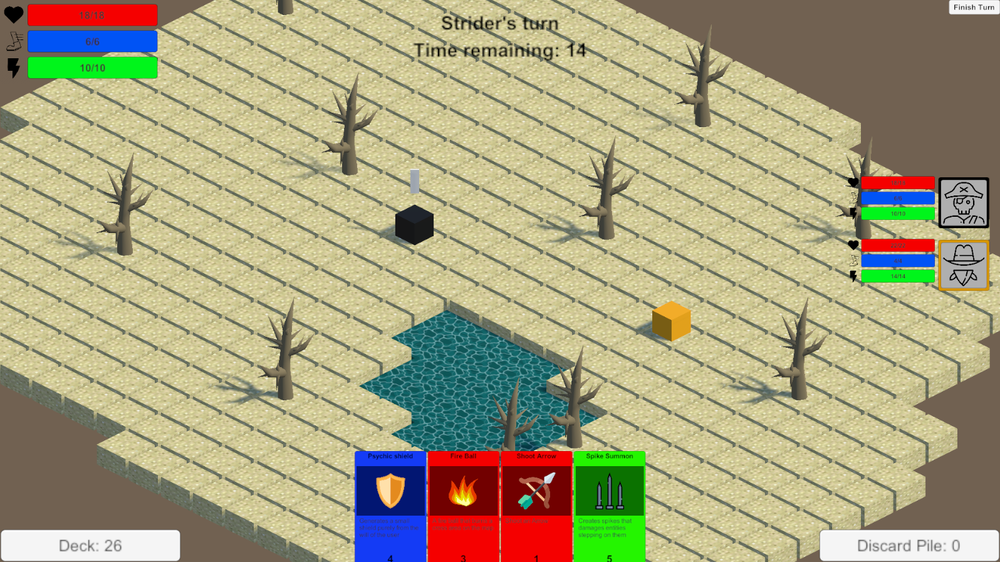
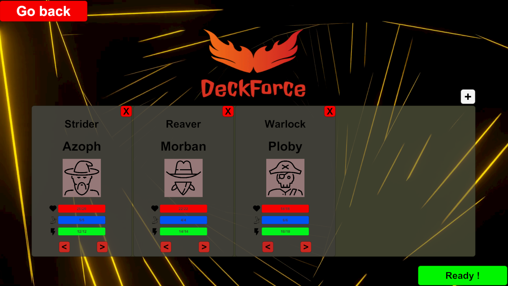
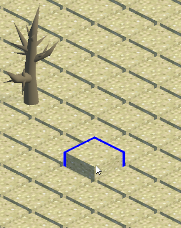
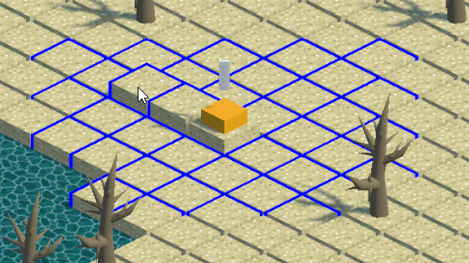
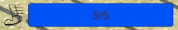
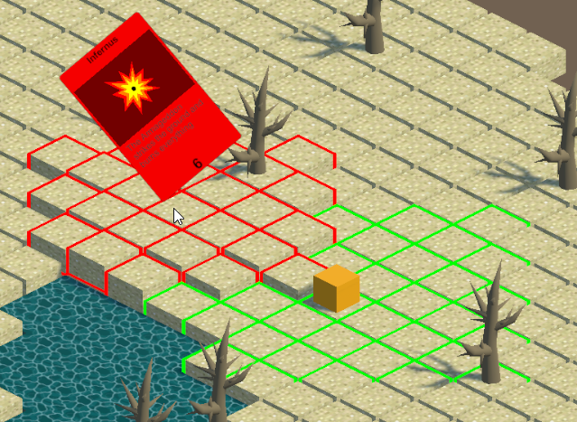
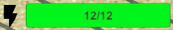

# Deckforce

Deckforce is multiplayer game that is a mix between a card game and a tactical turn-oriented combat game. The goal of the game is to beat your opponent(s) in an arena by using cards and create your own strategies.

This game was created for a university exam by a team of 5 students :
- Dorian Gomes      : Map and gameplay
- Malo de dinnechin : UI and gameplay
- Dorian You        : AI and gameplay
- Jules Fournier    : Card system
- Hugo Boichard     : Multiplayer integration

## Game rules

Before the game starts, each player has to choose a character with different stats and play styles.

After that, the map appears and each player has to choose where he wants to spawn on the map. The spawn points are indicated with a blue rectangle.

Then the game starts and the first player can play his turn. During your turn, you can move your player or you can use a card. To move your player, just click on it, and select the box you want to move to depending on the character move range.

Your movements are limited depending on your character.

To use a card, just drag and drop the card on the map and it will use it. When you drag a card, the range of activation of the card will appear arround the player in green and the range of the effect of the card will appear in red.

Like movements, you can use a limited amount of cards per turn depending on your character. The cost of a card is indicated at the bottom of the card.

When you are done with your turn, you can click on the top right button to end your turn. The game is over when there is only one player left alive.

## Multiplayer

:warning: ***Important : multiplayer is currently unvailable because there is no server running. However, you can still play a local game with a friend.***

To play in multiplayer, Deckforce use [Playfab](https://playfab.com/) to host a C# server made with [Telepathy](https://github.com/vis2k/Telepathy) (a simple TCP networking library) and deployed with Docker. It also use Playfab to create a matchmaking system and match players together.

## Controls

This game plays exclusively with the mouse. You can do all the actions with the `left mouse click` and you can move the camera in game with the `right mouse click`.